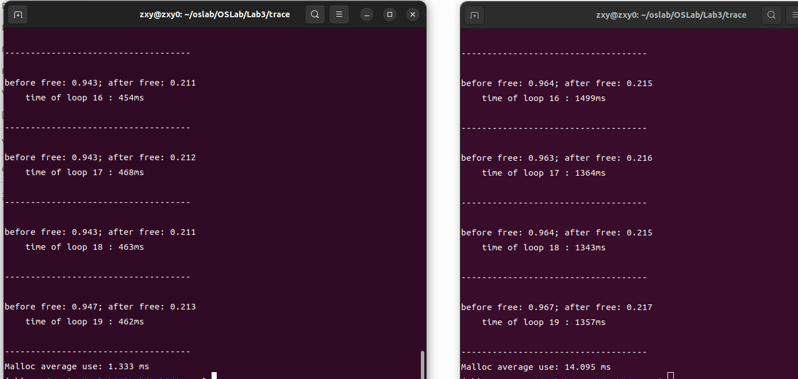

# OSLab3 内存分配器

### PB22151796 莫环欣

---

## 实验目的

- 学习内存分配与堆管理，尝试在已有框架下实现一个显式空闲链表控制的内存分配器
- 学会以动态链接库的形式制作并在其它语言代码中使用

## 实验环境

- 编写环境 ：Windows11 + VSCode
- 测试环境 : Ubuntu 22.04.4 LTS
- 使用 gcc 生成动态链接库
- 使用 g++ 编译测试程序

## 实验步骤

仔细阅读实验文档以及宏操作，学习已经定义的宏操作在已实现的函数中的使用

- memlib
  - 补全系统堆初始化函数
  - 补全用户堆与系统堆的接口函数，模拟 sbrk
- mm
  - 完成一个简单的分配器内存使用率统计
  - 完成空闲块的合并函数
  - 分别完成`first_fit`、`best_fit`两个策略的函数
  - 完成分配块的放置函数
  - 修改测试函数的输出形式
- 添加空间利用率与分配耗时的统计

## 代码原理

### 重要信息

本次实现的内存分配器共维护了两个堆，方便起见，将其称为`系统堆`与`用户堆`。

系统堆主要负责与内核进行对接，每次向内核申请内存时会统一申请一个较大的值（但不会特别大），之后按需分配给用户堆，用户堆则负责与用户（程序）进行直接对接，具体来说，结构如下所示

```
            内 核
              |
              |  内存不足时调用sbrk
              |
            系统堆
              |
              |  内存不足时调用mm_sbrk（一个仿制的函数，用于堆间内存分配）
              |
            用户堆
              |
              |  调用maloc
              |
            用户程序
```

显式空闲链表空闲块的结构如下：

```
        size | prev_alloc | alloc        <-- HDRP
               pred                      <-- bp
               succ                      <-- bp + WSIZE

            free space

        size | prev_alloc | alloc        <-- FTRP
```

用户程序在创建时（`workload_create`)，会首先调用系统堆的初始化函数，为系统堆分配一块初始内存`MAX_HEAP`，然后会向系统堆中放置序言块（避免边界检查）并为用户堆分配一块初始内存。

之后用户程序每次调用`malloc`请求分配内存时，会根据需求按照`first_fit`（找到第一个适合的空闲块）或者`best_fit`（找到剩余所有空闲块中最适合的内存）两种策略之一向用户分配一个内存块，同时应该说明：申请的实际上是用户堆的内存，当用户堆内存不足时会向系统堆申请增加（实际上只是增加了用户堆的堆顶指针），若系统堆的内存也不足，才会向内核中申请内存，这种措施很好地减少了等待时间（系统调用的开销会比手动维护分配更大）

### 系统堆的初始化

这是系统堆与内核之间的接口，其负责初始化系统堆，并设置用户堆的起始位置

```c
/*
 * mem_init - initialize the memory system model
 */
void mem_init(void)                             // 初始化并分配堆一
{
    mem_start_brk = (char *)sbrk(MAX_HEAP);     // 得到堆起始地址
    mem_brk = mem_start_brk;                    // 已分配堆顶指向起始位置
    mem_max_addr = mem_start_brk + MAX_HEAP;    // 当前堆上界
}
```

### 模拟内存分配

这是用户堆与系统堆之间的接口，当用户堆的空间不足时才会调用，根据具体情况选择直接增长堆顶指针或为系统堆分配更多的空间后再增长堆顶指针

```c
/*
 * mem_sbrk - simple model of the sbrk function. Extends the heap
 *    by incr bytes and returns the start address of the new area. In
 *    this model, the heap cannot be shrunk.
 */
void *mem_sbrk(int incr)
{
    char *old_brk = mem_brk;
    char *unused = NULL;
    if ((mem_brk + incr) <= mem_max_addr) {
        mem_brk += incr;
    }
    else {
        // 确保增量为MAX_HEAP整数倍
        int aligned_incr = ((int)(incr/MAX_HEAP) + 1) * MAX_HEAP;
        unused = (char *)sbrk(aligned_incr);
        if (unused == (char *)-1) {
            perror("sbrk");
            exit(EXIT_FAILURE);
        }
        mem_max_addr += aligned_incr;     // 修改堆1的大小
        mem_brk += incr;                  // 向堆1分配incr大小
    }
    return (void *)old_brk;
}
```

在该部分中，需要特别注意，调用`sbrk`函数时应该将其返回值赋给一个无用指针即可。
本人在编写时将其赋给了`mem_brk`，导致后续在删除空闲链表时出现段错误，
并且该 bug 十分隐蔽，本人对`place`与`coalesce`两个函数修改了两天都没想到这个位置会出错

    实际上代码中总共只有两处错误，都出现在非常意想不到的地方
    Segmentation fault 果然非常奇妙

### 分配策略

- 如果采用的是`first_fit`策略，那么分配器会遍历空闲链表，直到找到一个大小合适的空闲块，这时候就会直接返回空闲块的指针

```c
static void *find_fit_first(size_t asize)
{
    void *bp = NULL;
    for (bp = free_listp; bp != NULL; bp = (void *)GET_SUCC(bp)) {  // SUCC 是下一个空闲块
        if (asize <= GET_SIZE(HDRP(bp))) {  // 空闲块剩余空间大于asize即可
            return bp;
        }
    }
    return NULL; // 运行至此则没有合适空闲块
}
```

- `best_fit`策略同样遍历空闲链表，但是其除了需要找到大小合适的空闲块（`if`第一个条件）外，还需要找到合适的空闲块中剩余空间最小的那个，以达到更好的空间利用率，故其每次都需要遍历整个空闲链表

```c
static void* find_fit_best(size_t asize) {
    void *bp, *best_fit = NULL;
    size_t min_val = ~0;       // 先定义为无符号整数最大值
    size_t cur_val = 0;        // 存储空闲块剩余空间大小
    /* 遍历一次，找出最小值 */
    for (bp = free_listp; bp != NULL; bp = (void *)GET_SUCC(bp)) {
        cur_val = GET_SIZE(HDRP(bp)) - asize;
        if ((GET_SIZE(HDRP(bp)) > asize) && (cur_val < min_val)) {    // 找到更小的值
            best_fit = bp;
            min_val = cur_val;
        }
    }
    return best_fit; // 没有找到会返回NULL
}

```

这里需要格外注意的是，**不能将两个无符号数相减之后去与 0 做比较**，因为在发生下溢的情况下，会错误地将不符合要求的小空间块分配出去，从而导致段错误。

    这是原先代码中的另一处错误，比前一个相对好找一些，但依然很难顶

### 放置分配块

得到大小合适的空闲块之后，为了实际将其分配出去，我们需要维护一个放置函数`place`。
同时，由于我们使用的是显式空闲链表，其块头与块尾都需要占用空间，那么对于一个块分配后剩余的部分，需要进行两种考虑：

- 若剩余部分太小，应该将其一起分配出去
  - 将分配块从空闲链表中删除
  - 设置分配块的分配状态（只需修改头部）
  - 同时修改后一块的`prev_alloc`域
    - 若后块是空闲块，还应该修改其尾部
- 若剩余部分空间足够大，那么就应该将块分割为两个部分，剩余的部分作为新的空闲块加入空闲链表
  - 将分配块从空闲链表中删除
  - 修改其大小与分配状态
  - 空闲块的大小为剩余空间大小，`prev_alloc`域为 1
  - 再后一块无需修改

```c
static void place(void *bp, size_t asize)
{
    size_t total_size = GET_SIZE(HDRP(bp));      // 获取块大小

    if ((total_size - asize) > MIN_BLK_SIZE) {   // 剩余空间仍可作为空闲块
        PUT(HDRP(bp), PACK(asize, GET_PREV_ALLOC(HDRP(bp)), 1));    // 设置分配块
        delete_from_free_list(bp);               // 从空闲链表中删除
        /* 修改空闲块 */
        PUT(HDRP(NEXT_BLKP(bp)), PACK(total_size-asize, 1, 0));
        PUT(FTRP(NEXT_BLKP(bp)), PACK(total_size-asize, 1, 0));
        add_to_free_list(NEXT_BLKP(bp));
        /* 分配块只有块头，空闲块有块头和块尾 */
        /* 后面的块不需要改动 */
    }
    else {                                      // 余额太小，应该全部分配
        delete_from_free_list(bp);
        // 修改为已分配
        PUT(HDRP(bp), PACK_ALLOC(GET(HDRP(bp)), 1));
        // 对下一个相邻块设置该块的分配状态
        PUT(HDRP(NEXT_BLKP(bp)), PACK_PREV_ALLOC(GET(HDRP(NEXT_BLKP(bp))), 1));
        if (GET_ALLOC(HDRP(NEXT_BLKP(bp))) == 0){      // 相邻块未分配
            // 对下一个相邻块设置该块的分配状态
            PUT(FTRP(NEXT_BLKP(bp)), PACK_PREV_ALLOC(GET(HDRP(NEXT_BLKP(bp))), 1));
        }
    }
}
```

### 合并

同时，为了避免空闲块过于碎片化及提高空间利用率（过于碎片化的空间无法满足大内存的分配需求），还需要把相邻的空闲块合并起来，这就又需要维护一个函数

对于一个空闲块，其前后块共有四种可能的组合情况，根据不同的组合情况进行不同处理即可。
具体如注释所述

```c
static void *coalesce(void *bp)
{
    /*add_to_free_list(bp);*/
    size_t prev_alloc = GET_PREV_ALLOC(HDRP(bp));
    size_t next_alloc = GET_ALLOC(HDRP(NEXT_BLKP(bp)));
    size_t size = GET_SIZE(HDRP(bp));
    if (prev_alloc && next_alloc) /* 前后都是已分配的块 */
    {   // 修改后一个块的头部
        PUT(HDRP(NEXT_BLKP(bp)), PACK_PREV_ALLOC(GET(HDRP(NEXT_BLKP(bp))), 0));
        // 修改自身
        PUT(HDRP(bp), PACK_ALLOC(GET(HDRP(bp)), 0));
        PUT(FTRP(bp), PACK_ALLOC(GET(HDRP(bp)), 0));
        add_to_free_list(bp);                  // 将新的空闲块加入空闲链表
    }
    else if (prev_alloc && !next_alloc) /*前块已分配，后块空闲*/
    {
        size += GET_SIZE(HDRP(NEXT_BLKP(bp)));// 加上后块的大小
        delete_from_free_list(NEXT_BLKP(bp)); // 合并之后空闲链表中就不存在单独的后块了
        PUT(HDRP(bp), PACK(size, 1, 0));      // 向头部和尾部添加大小、前邻居块分配、自身空闲
        PUT(FTRP(bp), PACK(size, 1, 0));      // 先修改头部，size改变了才方便修改尾部
        // 再往后的块无需修改
        add_to_free_list(bp);                 // 将新的空闲块加入空闲链表
    }
    else if (!prev_alloc && next_alloc) /*前块空闲，后块已分配*/
    {   // 前块需要被合并时，可以不用修改空闲链表（因为指针位置是固定的）
        bp = PREV_BLKP(bp);                   // 移动指针到前块位置
        size += GET_SIZE(HDRP(bp));
        PUT(HDRP(bp), PACK(size, GET_PREV_ALLOC(HDRP(bp)), 0));
        PUT(FTRP(bp), PACK(size, GET_PREV_ALLOC(HDRP(bp)), 0));
        // 修改后块
        PUT(HDRP(NEXT_BLKP(bp)), PACK_PREV_ALLOC(GET(HDRP(NEXT_BLKP(bp))), 0));
    }
    else /*前后都是空闲块*/
    {
        size = size + GET_SIZE(HDRP(PREV_BLKP(bp))) + GET_SIZE(HDRP(NEXT_BLKP(bp)));
        delete_from_free_list(NEXT_BLKP(bp));
        bp = PREV_BLKP(bp);      // 并非通过空闲块获取地址，所以先删除没有影响
        PUT(HDRP(bp), PACK(size, GET_PREV_ALLOC(HDRP(bp)), 0));
        PUT(FTRP(bp), PACK(size, GET_PREV_ALLOC(HDRP(bp)), 0));
        // 再往后的块无需修改
    }
    return bp;
}
```

### 空间利用率统计

- `user_malloc_size`：
  - 分配时
    - 在`mm_malloc`函数中，每次调用`place`放置分配块**之后**叠加，且统计不考虑头块
    - `user_malloc_size += (GET_SIZE(HDRP(bp)) - WSIZE);`
  - 释放时
    - 在`mm_free`函数中，每次调用`coalesce`函数合并空闲块**之前**递减，且不考虑头块
      - 因为在叠加时就不考虑头块
    - `user_malloc_size -= (size - WSIZE);`
- `heap_size`：
  - 其只会增加，不会减少
  - 在`mm_init`初始化堆 2 时，将`CHUNKSIZE`（即`4kb`，堆 2 的初始大小）赋给`heap_size`
    - `heap_size = CHUNKSIZE;`
  - 之后每次调用`extend_size`向用户堆增加空间时，都会对应地增长`heap_size`
    - `heap_size += size;`

### 分配时间统计

这里需要修改`workload`中的`gen_random_string`函数与`workload_run`函数，统计每次调用`malloc`的时间并叠加，最后除以总循环次数，即可得到平均调用时间，进而可以比较出两种分配策略的分配时间长短

- 额外定义的全局变量 `long malloc_time_cnt;`
- `gen_random_string`函数修改部分

```c

    struct timeval curtime;
    gettimeofday(&curtime, NULL);
    long sec1 = curtime.tv_sec, usec1 = curtime.tv_usec;
    if ((string = (char*) malloc(length)) == NULL )
	{
		std::cerr << "Malloc failed at genRandomString!" << std::endl;
		return NULL ;
	}
    gettimeofday(&curtime, NULL);
    long sec2 = curtime.tv_sec, usec2 = curtime.tv_usec;

    malloc_time_cnt += (sec2-sec1)*1000 + (usec2-usec1)/1000;
```

- `workload_run`函数修改部分，放置在 for 循环退出后、return 前

```c
std::cout << "Malloc average use: "<<((double)malloc_time_cnt/(LOOP_NUM+1))<<" ms"<< std::endl;
```

### 实验结果


左边的`Shell`中呈现的是`first_fit`策略的测试结果，右边的`Shell`中呈现的是`best_fit`策略的测试结果

通过对比可以发现：

- 最先匹配策略的分配耗时更短，但是空间利用率稍低一些
- 最优匹配策略的分配耗时更长，但是空间利用率更高一些
- 两者的空间利用率相近，但是分配耗时相差巨大（本次代码的特性）

由于在对分配块进行释放时，我们对附近的空闲块进行了合并，使得两种策略都有了比较好的空间利用率，
同时也使得最先匹配策略的空间利用率与最优匹配策略相近（虽然还是后者更高一些）。

但是由于没有设计函数优化最优匹配策略遍历空闲链表的过程，最先匹配策略的优势依然存在，这就导致最先匹配策略的时间优势依然存在且非常明显（从最后的结果就可以看出）

## 总结

通过本次实验，尤其深刻地体会到了**段错误**的抽象程度及其 debug 过程的艰辛。

此外，还学会了如何管理堆，如何定义宏操作以美化代码，如何制作和使用动态链接库，同时加深了对于内存分配器的理解，

此外，十分感谢邓助教与李助教，他们救我于水火之中，为我 debug 起到了非常大的作用

    评价为： 非常好实验，非常好助教

```
                   _ooOoo_
                  o8888888o
                  88" . "88
                  (| -_- |)
                  O\  =  /O
               ____/`---'\____
             .'  \\|     |//  `.
            /  \\|||  :  |||//  \
           /  _||||| -:- |||||-  \
           |   | \\\  -  /// |   |
           | \_|  ''\---/''  |   |
           \  .-\__  `-`  ___/-. /
         ___`. .'  /--.--\  `. . __
      ."" '<  `.___\_<|>_/___.'  >'"".
     | | :  `- \`.;`\ _ /`;.`/ - ` : | |
     \  \ `-.   \_ __\ /__ _/   .-` /  /
======`-.____`-.___\_____/___.-`____.-'======
                   `=---='
^^^^^^^^^^^^^^^^^^^^^^^^^^^^^^^^^^^^^^^^^^^^^
            佛祖保佑       永无BUG


┌───┐   ┌───┬───┬───┬───┐ ┌───┬───┬───┬───┐ ┌───┬───┬───┬───┐ ┌───┬───┬───┐
│Esc│   │ F1│ F2│ F3│ F4│ │ F5│ F6│ F7│ F8│ │ F9│F10│F11│F12│ │P/S│S L│P/B│  ┌┐    ┌┐    ┌┐
└───┘   └───┴───┴───┴───┘ └───┴───┴───┴───┘ └───┴───┴───┴───┘ └───┴───┴───┘  └┘    └┘    └┘
┌───┬───┬───┬───┬───┬───┬───┬───┬───┬───┬───┬───┬───┬───────┐ ┌───┬───┬───┐ ┌───┬───┬───┬───┐
│~ `│! 1│@ 2│# 3│$ 4│% 5│^ 6│& 7│* 8│( 9│) 0│_ -│+ =│ BacSp │ │Ins│Hom│PUp│ │N L│ / │ * │ - │
├───┴─┬─┴─┬─┴─┬─┴─┬─┴─┬─┴─┬─┴─┬─┴─┬─┴─┬─┴─┬─┴─┬─┴─┬─┴─┬─────┤ ├───┼───┼───┤ ├───┼───┼───┼───┤
│ Tab │ Q │ W │ E │ R │ T │ Y │ U │ I │ O │ P │{ [│} ]│ | \ │ │Del│End│PDn│ │ 7 │ 8 │ 9 │   │
├─────┴┬──┴┬──┴┬──┴┬──┴┬──┴┬──┴┬──┴┬──┴┬──┴┬──┴┬──┴┬──┴─────┤ └───┴───┴───┘ ├───┼───┼───┤ + │
│ Caps │ A │ S │ D │ F │ G │ H │ J │ K │ L │: ;│" '│ Enter  │               │ 4 │ 5 │ 6 │   │
├──────┴─┬─┴─┬─┴─┬─┴─┬─┴─┬─┴─┬─┴─┬─┴─┬─┴─┬─┴─┬─┴─┬─┴────────┤     ┌───┐     ├───┼───┼───┼───┤
│ Shift  │ Z │ X │ C │ V │ B │ N │ M │< ,│> .│? /│  Shift   │     │ ↑ │     │ 1 │ 2 │ 3 │   │
├─────┬──┴─┬─┴──┬┴───┴───┴───┴───┴───┴──┬┴───┼───┴┬────┬────┤ ┌───┼───┼───┐ ├───┴───┼───┤ E││
│ Ctrl│    │Alt │         Space         │ Alt│    │    │Ctrl│ │ ← │ ↓ │ → │ │   0   │ . │←─┘│
└─────┴────┴────┴───────────────────────┴────┴────┴────┴────┘ └───┴───┴───┘ └───────┴───┴───┘


```
