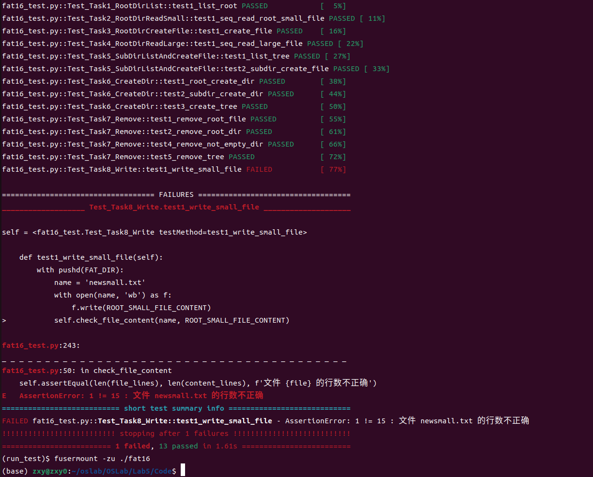
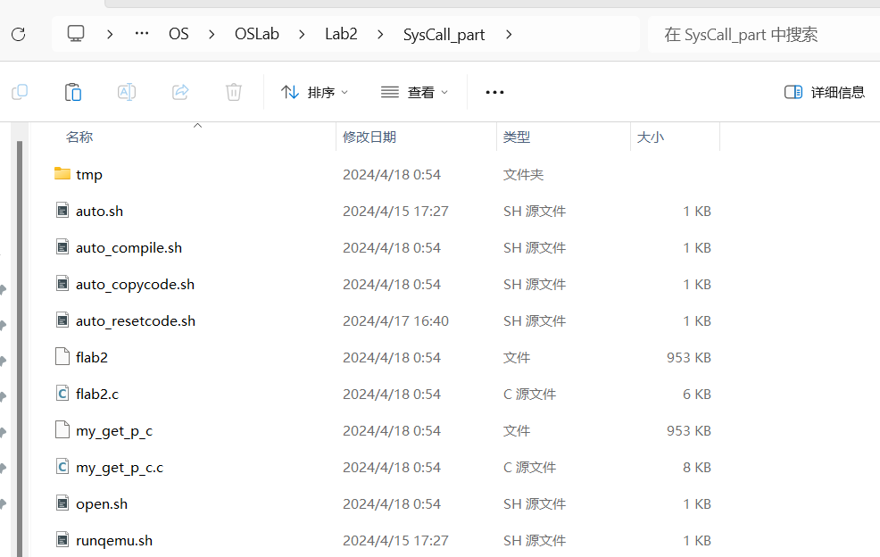
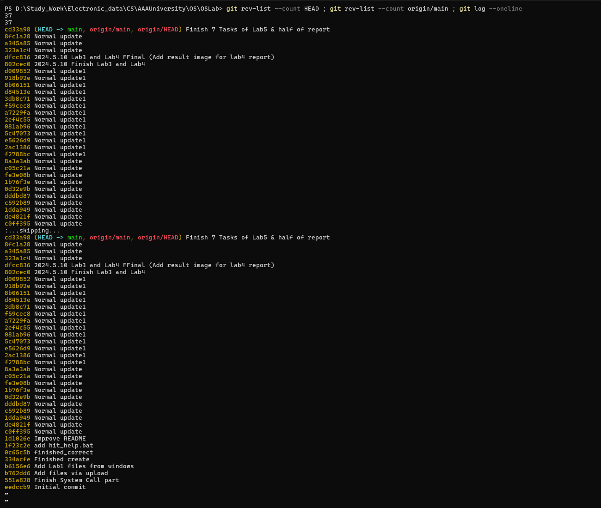

# FAT16 文件系统

### PB22151796 莫环欣

---

## 实验结果



完成了 7 个任务，最后一个任务的代码也已编写完毕（但是没有 debug）

## 实验目的

- 熟悉文件系统的基本功能与工作原理（理论基础）
- 熟悉 FAT16 的存储结构，利用 FUSE 实现一个 FAT 文件系统：
  - 根目录下，文件与目录的读操作、创建操作
  - 非根目录下的文件与目录的读、创建操作
  - 文件与目录的删除操作
  - 文件的写操作
- 了解 pytest

## 实验环境

- 编写：Win11 + vscode（万物 vsc）
- 测试：VirtualBox
- OS: Ubuntu 22.04 LTS
- libfuse3

## 实验步骤

首先安装所需库

    sudo apt install libfuse3-dev pkg-config python3 python3-pip fuse3
    pip install pytest

接着需要为所有测试脚本赋予可执行权限

    chmod +x

测试前，需要确保 python 环境大于 3.9

    python -V

最后进入实验代码所在目录，运行自动化测试脚本即可

    ./test/run_test.sh

若仅需挂载镜像不自动测试，可执行下面的脚本

    ./test/run_mount.sh

## 代码原理

### 读根目录

这里需要完成`fat16_readdir`与`fill_entries_in_sectors`两个函数

- `fat16_readdir`： 这里需要补充根目录情况下两个变量的赋值

  - 目的是从根目录的开始扇区往后扫描整个根目录扇区
  - 故直接将`meta`的`root_sec`和`root_sectors`两个成员赋出去即可
    ```c
    // 根目录开始扇区号
    sector_t first_sec = meta.root_sec;
    // 根目录区域扇区数
    size_t nsec = meta.root_sectors;
    ```

- `fill_entries_in_sectors`：这里需要补全当前的扇区号、扇区扫描的区间、目录名的长度转换

  - 由于是在`for`循环中，且有起始地址，故直接将起始地址加上循环变量赋值出去即可
  - 此外，每个扇区的大小可以从`meta`的成员中获取，每个目录项的大小也有定义
  - 转换为长名只需根据`to_long_name`函数的接口传入即可

    ```c
    // 每轮循环需要操作的扇区号
    sector_t sec = first_sec + i;

    // 遍历条件
    for(size_t off = 0; off < meta.sector_size; off += DIR_ENTRY_SIZE )

    // 调用 to_longname 函数，将 entry->DIR_Name 转换为长文件名，结果放在 name 中
    int ret = to_longname(entry->DIR_Name, name, MAX_NAME_LEN);

    ```

### 读根目录下的短文件

这里需要完成两个函数

- `find_entry_in_sectors` ：
  - 仿照上面已经完成的`find_entries_in_sectors`函数即可
  - 从`from_sector`开始搜索`sectors_count`个扇区
    - 首先将整个扇区的内容读入缓存中
    - 接着对当前扇区中的所有目录项调用`check_name`函数进行检查
      - 若找到对应的目录项，直接返回`FIND_EXIST`
      - 若找到空槽，也直接返回`FIND_EMPTY`
    - 对所有扇区进行相同的检测操作
  - 若所有扇区都未能查找到目录项或空槽，返回`FIND_NULL`

```c
    for(size_t i=0; i < sectors_count; i++) {       // 搜索 sectors_count 个扇区
        sector_t sec = from_sector + i;             // 从 from_sector 开始搜索
        int ret = sector_read(sec, buffer);         // 读取扇区内容到缓存中
        if(ret < 0) {
            return -EIO;
        }
        /* 对单个扇区内的目录项进行搜索 */
        for(size_t off = 0; off < meta.sector_size; off += DIR_ENTRY_SIZE ) {
            DIR_ENTRY* entry = (DIR_ENTRY*)(buffer + off);
            if(de_is_valid(entry)) {    // 有效目录项
                // 将 filler 函数的调用改为check_name的检查
                // 无需调用to_longname， check_name中会自动处理
                if(check_name(name, len, entry)) {
                    // 找到匹配项
                    // 修改 slot 的三个属性
                    slot->dir = *entry;
                    slot->sector = sec;
                    slot->offset = off;
                    return FIND_EXIST;
                }
            }
            if(de_is_free(entry)) {
                // 由于找到空槽会直接返回
                // 所以空槽也要记录下来
                    slot->dir = *entry;
                    slot->sector = sec;
                    slot->offset = off;
                return FIND_EMPTY;
            }
        }
    }
```

- `read_from_cluster_at_offset` ：

  - 为了确保扇区内偏移量确实在扇区内，应该把传入的偏移量模扇区大小
  - 之后计算出需要复制的长度，每次调用`memcpy`复制合理长度的数据到缓存中，并更新已复制字节数
    - 循环操作，直到全部读取完毕

  ```c
  // 扇区内偏移量。
  size_t sec_off = offset % meta.sector_size;

  ```

  ```c
    /* 计算需要复制的长度，若当前扇区剩余长度不足，则需要全部复制后再搜索下一个扇区 */
    size_t copy_bytes = min(meta.sector_size - sec_off, size - pos);
    /* 将扇区偏移后的copy_bytes个字节数据复制到data + pos 位置 */
    memcpy(data + pos, sector_buffer + sec_off, copy_bytes);
    /* 更新已读取的字节数 */
    pos += copy_bytes;
  ```

### 创建根目录下的文件

此处需要补全两个函数

- `dir_entry_create` ：

  - 此处补全较为简单，将传入的参数全部赋给`dir`的成员即可

  ```c
  /* 把传入的参数全部对 DIR 赋值即可 */
  memcpy(dir->DIR_Name, shortname, FAT_NAME_LEN); // 使用 memcpy 函数来设置 DIR_Name
  dir->DIR_Attr = attr;            // 设置 DIR_Attr
  dir->DIR_FstClusHI = 0;          // 设置 DIR_FstClusHI （永远为0）
  dir->DIR_FstClusLO = first_clus; // 设置 DIR_FstClusLO
  dir->DIR_FileSize = file_size;   // 设置 DIR_FileSize
  ```

- `dir_entry_write` ：

  - 为了防止数据被破坏，先将数据从扇区中读入缓存
  - 接着在缓存对应的位置进行修改
  - 最后将缓存的内容应用到整个扇区

  ```c
  /* 传入： 扇区号， 缓存地址 */
  int ret = sector_read(slot.sector, sector_buffer);
  /* slot.offset 是当前已经使用的总长度 */
  /* 传入： 修改位置地址（缓存）， 修改来源地址， 修改量大小 */
  memcpy(sector_buffer + slot.offset, &(slot.dir), sizeof(DIR_ENTRY));
  /* 当前扇区的最新所有数据都在缓存中，应该全部写回 */
  /* 传入： 扇区号， 缓存地址 */
  ret = sector_write(slot.sector, sector_buffer);
  ```

### 读根目录下的长文件

- `read_fat_entry` ：
  - 给定簇号，获取并`FAT`表中对应的表项
  - 首先找到扇区和在扇区内的位置
  - 接着使用`sector_read`将扇区数据读入缓存中
  - 最后将缓存中对应位置的数据返回

```c
    /* 计算扇区号，每个FAT表项占用2字节 */
    sector_t sec = meta.fat_sec + clus / (meta.sector_size / 2);
    /* 计算扇区内偏移量 */
    size_t off = (clus % (meta.sector_size / 2)) * 2;
    /* 获取表项的大小 */
    int ret = sector_read(sec, sector_buffer);
    if(ret < 0) {
        return ret;
    }

    return *(cluster_t*)(sector_buffer + off);
```

- `fat16_read` ：
  - 该函数需要完成读取跨簇文件的部分
  - 可以循环进行，每次只读取合法范围数据
  ```c
  /* (还有数据需要读取) && 簇号有效 */
  while((p < size) && is_cluster_inuse(clus)) {
      /* min(不需要读取到簇末尾， 需要读取到簇末尾) */
      size_t Dread_len = min(size - p, meta.cluster_size - offset);   // Data_read_lenth
      /* 考虑到跨簇读取，应该写入缓存中实际已经写好的位置之后 */
      int ret = read_from_cluster_at_offset(clus, offset, buffer + p, Dread_len);
      if(ret < 0) {
          return ret;
      }
      /* p 自增本轮实际读取的长度 */
      p += ret;
      /* 读取一轮之后，下一簇必然是从起始位置开始访问的 */
      offset = 0;
      /* 更新clus */
      clus = read_fat_entry(clus);
  }
  ```

### 读取/创建非根目录下的文件

- `find_entry_internal` ：

  - 本函数需要完成查找非根目录路径的目录项的部分

  ```c
  state = find_entry_in_sectors(
            *remains,
            len,
            cluster_first_sector(clus),
            meta.sec_per_clus,
            slot
          );
  ```

### 创建目录

- `fat16_mkdir`：创建`path`对应的文件

  - 这里仿照创建文件函数`mknod`的结构即可，具体如下

  ```c
    /* 先找到一个空闲目录项 */
    ret = find_empty_slot(path, &slot, &filename);
    if(ret < 0) {
        return ret;
    }
    /* 将长文件名转化为短文件名 */
    char shortname[11];
    ret = to_shortname(filename, MAX_NAME_LEN, shortname);
    if(ret < 0) {
        return ret;
    }
    /* 准备工作完毕，分配一个空闲簇 */
    ret = alloc_one_cluster(&dir_clus);
    if(ret < 0) {
        return ret;
    }
    /* 创建目录项 */
    ret = dir_entry_create(slot, shortname, ATTR_DIRECTORY, dir_clus, 0);
    if(ret < 0) {
        return ret;
    }
  ```

- `write_fat_entry`：写入`FAT`表项

  - 这里在循环时先将扇区中的内容读取到缓存中，接着修改缓存对应偏移处的值，最后再将缓存中的数据写回扇区
    - 这是为了避免破坏数据

  ```c
  /* 计算第 i 个 FAT 表所在扇区，进一步计算clus对应的FAT表项所在扇区*/
  sector_t sec = meta.fat_sec + i * meta.sec_per_fat + clus_sec;
  int ret = sector_read(sec, sector_buffer); // 读取该扇区
  if(ret < 0) {
      return ret;
  }
  // *(cluster_t*)(sector_buffer + sec_off) = data;在对应位置修改数据
  memcpy(sector_buffer + sec_off, &data, sizeof(cluster_t));
  ret = sector_write(sec, sector_buffer); // 将该扇区写回
  if(ret < 0) {
      return ret;
  }
  ```

- `alloc_one_cluster`：分配一个空闲簇
  - 扫描整个`FAT`表，直到找到一个空闲簇为止
  ```c
    /* 扫描FAT表找一个空闲簇，从MIN扫到MAX*/
    cluster_t ClusN = CLUSTER_MIN;
    /* 感觉这样会比调用is_cluster_inuse节约一点资源？ */
    while(ClusN <= CLUSTER_MAX) {
        /* 找到空闲簇 */
        if (read_fat_entry(ClusN) == CLUSTER_FREE) {
            /* 记录簇号 */
            *clus = ClusN;
            /* 将FAT表项指向CLUSTER_END */
            write_fat_entry(*clus, CLUSTER_END);
            /* 清零 */
            cluster_clear(*clus);
            /* 返回 */
            return 0;
        }
        ClusN++;
    }
    /* 找不到 */
    return -ENOSPC;
  ```

### 删除文件/目录

- `fat16_unlink`：删除文件

  - 要删除一个文件，首先需要找到它，并且确认其属性是一个文件
  - 但是我们并不需要真的将其“删除”，只需要释放它占用的簇，并将其标记为删除即可

  ```c
    /* 找到目录项 */
    int ret = find_entry(path, &slot);
    if(ret < 0) {
        return ret;
    }
    /* 确认目录项是个文件 */
    if(attr_is_directory(dir->DIR_Attr)) {
        return -EISDIR;
    }
    /* 释放占用的簇 */
    free_clusters(dir->DIR_FstClusLO);
    /* 修改目录项为删除 */
    dir->DIR_Name[0] = NAME_DELETED;
    /* 写回目录项 */
    ret = dir_entry_write(slot);
  ```

- `fat16_rmdir`：删除目录

  - 与删除目录类似
    - 但删除目录还需要确保其为空
      - 即除了"."和".."外再无其余内容
      - 删除含有内容的文件夹，实际上就是递归调用这两个函数
  - 检查目录是否为空
    - 遍历目录占有的所有簇中的所有扇区
      - 这里与读目录类似
      - 区别在于，当检查到扇区中的目录项时：
        - 检查目录项是否为空
        - 若为空，跳过
        - 若不为空
          - 检查是否为"."或".."
            - 若不是，说明目录不为空，返回错误
    - 遍历完当前簇之后，通过读取`FAT`表项进入相连的下一个簇
  - 确保目录为空之后，进行删除操作
    - 首先，调用函数释放目录占用的所有簇
    - 接着，将文件标记为删除
      - 这里也需要先读取、修改、写回

  ```c
    // 检查是否合法**********************************************
    cluster_t clus = CLUSTER_END;
    DirEntrySlot slot;
    /* 找到目录项 */
    int ret = find_entry(path, &slot);
    if(ret < 0) {
        return ret;
    }
    DIR_ENTRY* dir = &(slot.dir);
    /* 若不是目录，返回错误 */
    if(!attr_is_directory(dir->DIR_Attr)) {
        return -ENOTDIR;
    }

    // 检查目录是否为空******************************************

    /* 从目录项中获取簇号 */
    clus = dir->DIR_FstClusLO;

    while(is_cluster_inuse(clus)) {
        /* 从簇的第一个扇区开始扫描 */
        sector_t fst_clus_sec = cluster_first_sector(clus);
        /* 获取扇区总数 */
        size_t nsec = meta.sec_per_clus;
        char sector_buffer[MAX_LOGICAL_SECTOR_SIZE];
        /* 遍历扇区 */
        for (size_t i = 0; i < nsec; i++){
            /* 当前操作扇区 */
            sector_t sec = fst_clus_sec + i;
            /* 读入缓存 */
            int ret = sector_read(sec, sector_buffer);
            if(ret < 0) {
                return -EIO;
            }
            /* 检查每一个目录项 */
            for (size_t off = 0; off < meta.sector_size; off += DIR_ENTRY_SIZE) {
                /* buffer中存储了扇区中的全部数据，每次检查一个目录项 */
                DIR_ENTRY* entry = (DIR_ENTRY*)(sector_buffer + off);
                /* 目录不为空 */
                if(de_is_valid(entry)) {
                    /* 不是 . 或 ..  */
                    if (!de_is_dot(entry)) {
                        return -ENOTEMPTY;
                    }
                }
            }
        }
        /* 进入目录的下一个簇 */
        clus = read_fat_entry(clus);
    }
    /* 释放目录的簇 */
    free_clusters(dir->DIR_FstClusLO);
    /* 标记为删除 */
    char buff[MAX_LOGICAL_SECTOR_SIZE];
    dir->DIR_Name[0] = NAME_DELETED;
    /* 读出、修改、写回 */
    sector_read(slot.sector, buff);
    memcpy(buff + slot.offset, &(slot.dir), DIR_ENTRY_SIZE);
    sector_write(slot.sector, buff);
  ```

### 写入文件

由于近期为考试月，许多科目需要补天，且之前`删除文件/目录`部分尚未完成，故该部分一直拖着没做，截至写报告时（2024/6/7 ; 20:24）刚完成基础的代码逻辑编写（之前已经基本写完了，今晚就改了一下`fat16_write`），debug 的助教处有很多人排队，因此决定放弃该部分。但**写都写了**，还是展示一下部分逻辑（感觉大体应该是对的）

- `fat16_write`：将数据写入到文件中

  - 首先检查是否需要分配新的簇
    - 先遍历文件的`FAT`表，获取其最后一个簇号与占用簇数
    - 接着判断加上需要写入内容的大小后是否大于已分配大小
      - 若大于，则新分配合适数量的簇
      - 分配好后，将新分配的簇连接到已有的`FAT`表里
  - 空间检查完毕后，将数据写入对应的偏移处
    - 先移动簇号到偏移开始簇
    - 接着计算应该写入这个簇中的偏移量
    - 若这个簇无法写入全部内容，则进入下一个簇继续写
  - 最后将更新后的文件写回即可

  ```c
    /* 检查是否需要新分配簇 */

    size_t clus_cnt = 0;                         // 文件的簇总数
    cluster_t lst_clus = CLUSTER_END;       // 文件的最后一个被使用簇号
    cluster_t clus = dir->DIR_FstClusLO;
    while(is_cluster_inuse(clus)){
        clus_cnt++;
        lst_clus = clus;
        clus = read_fat_entry(clus);
    }

    /* 需要分配新簇 */
    if ((dir->DIR_FileSize + size) > (clus_cnt * meta.sec_per_clus * meta.sector_size)) {
        size_t new_len = (size + meta.cluster_size - 1) / meta.cluster_size;
        /* 分配 */
        int ret = alloc_clusters(new_len, &clus);
        if (ret < 0) {
            return ret;
        }
        /* 连接 */
        if (lst_clus == CLUSTER_END) {
            /* 空文件 */
            dir->DIR_FstClusLO = clus;
        }
        else {
            write_fat_entry(lst_clus, clus);
        }
    }

    /* 分配检查完毕，写入对应偏移处 */
    /* 找到写入位置的起始簇 */
    sector_t clus_start = offset / (meta.sector_size * meta.sec_per_clus);

    /* 让clus从文件簇头开始移动到起始簇的位置 */
    clus = dir->DIR_FstClusLO;
    for (size_t i = 0; i < clus_start; i++) {
        if (!is_cluster_inuse(clus)){
            return 0;
        }
        clus = read_fat_entry(clus);
    }
    /* 当前已写入字节数 */
    size_t cur_off = 0;
    /* 簇内偏移 */
    size_t clus_off = offset % (meta.sector_size * meta.sec_per_clus);

    while (cur_off < size) {
        /* 当前写入长度 */
        size_t write_len=min(size-cur_off,meta.sector_size*meta.sec_per_clus-clus_off);
        /* 写入簇偏移位置 */
        write_to_cluster_at_offset(clus, clus_off, data + cur_off, write_len);
        /* 进入下一个簇 */
        clus = read_fat_entry(clus);
        clus_off = 0;
        cur_off += write_len;
    }

    dir_entry_write(slot); // 将更新后的目录项写回
    return cur_off;
  ```

- `write_to_cluster_at_offset`： 在指定的偏移位置处写入内容
  - 先计算出需要写入的扇区与扇区内偏移量
  - 同样，分多次将内容写入扇区（可能有多个）中
    - 一样需要读出、修改、写回
  - 最后返回成功写入的字节数
  ```c
    uint32_t sec = cluster_first_sector(clus) + offset / meta.sector_size;
    size_t sec_off = offset % meta.sector_size;
    size_t pos = 0; // 实际已经写入的字节数
    while(pos < size) { // 还没有写入完毕
        int ret = sector_read(sec, sector_buffer);
        if(ret < 0) {
            return ret;
        }
        // 计算本次需要写入的字节数
        size_t to_write = min(size - pos, meta.sector_size - sec_off);
        memcpy(sector_buffer + sec_off, data + pos, to_write); // 将数据写入扇区中的正确位置
        ret = sector_write(sec, sector_buffer); // 将扇区写回
        if(ret < 0) {
            return ret;
        }
        pos += to_write;
        sec_off = 0;
        sec++;
    }
    return pos;
  ```
- `alloc_clusters`：
  - 先扫描`FAT`表，直到找到`n`个空闲簇
  - 接着将最后一个簇设置为尾部
  - 再将所有簇依次相连，并清空每个簇的内容
  - 最后将分配的收个簇返回
  ```c
    cluster_t clusNum = CLUSTER_MIN;
    /* 未找齐N个空闲簇，并且簇未扫描完毕 */
    // 扫描FAT表，找到n个空闲的簇，存入cluster数组。
    while((allocated < n) && (is_cluster_inuse(clusNum))) {
        if(read_fat_entry(clusNum) == CLUSTER_FREE) {
            clusters[allocated] = clusNum;
            allocated++;
        }
        clusNum++;
    }
    /* 找不到n个簇，分配失败， free(clusters)，返回 -ENOSPC*/
    if(allocated != n) {
        free(clusters);
        return -ENOSPC;
    }
    clusters[n] = CLUSTER_END; // 将最后一个簇连接至 CLUSTER_END
    /* 修改clusters中存储的N个簇对应的FAT表项，将每个簇与下一个簇连接在一起。
    同时清零每一个新分配的簇。*/
    for(size_t i = 0; i < n; i++) {
        cluster_clear(clusters[i]);
        write_fat_entry(clusters[i], clusters[i + 1]);
    }
    *first_clus = clusters[0]; // 将 first_clus 设置为第一个簇的簇号
  ```

## 学期小总结

本学期 OS 实验圆满（虽然说其实也没那么圆满）结束，通过本学期的实验实操，成功入门了之前一直想接触的虚拟机、`Linux`、makefile，对于 git 管理、命令行操作、指针使用等的理解更为深刻，且深切体会到了自动化/半自动化（脚本/批处理文件）的便利之处（还学习了助教们写的测试文件）。

<dev>


    主文件夹结构，通过github进行主机与虚拟机通信，
    把推送与拉取（私人仓库，ssh连接）都自动化了

</dev>

<dev>



    Lab2的执行不同功能的脚本

</dev>

<dev>



    提交记录

</dev>
